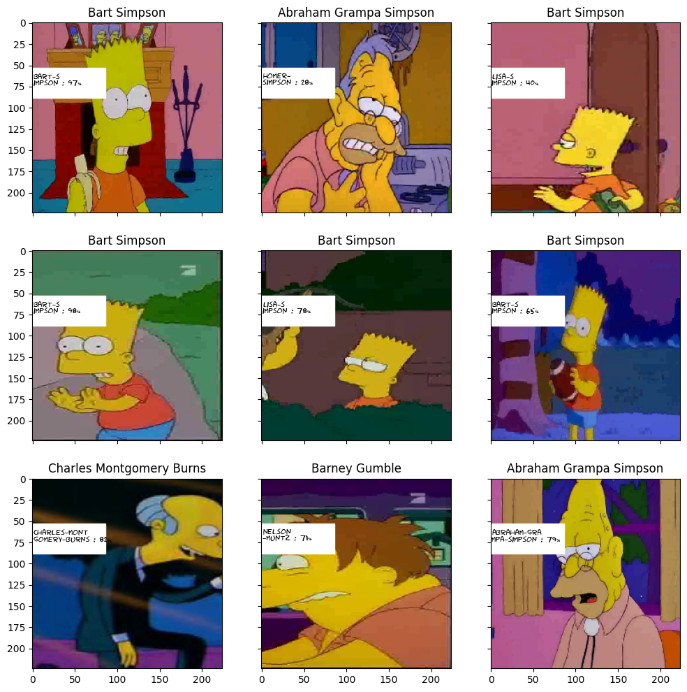
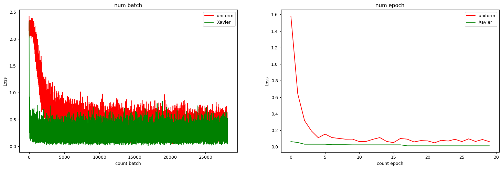
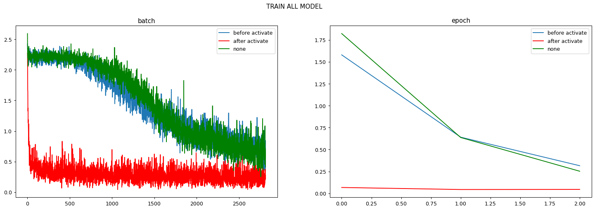

# pets
Итак, в нашей баночке есть:

 - **Логистическая регрессия** своими руками [notebook](linear_models_hand_made/linear_models.ipynb)

 - **Решение распознования Симпсонов** с кэггл [notebook](simsons_kaggle/final_simsons.ipynb)
 
  

 - **Предсказания оттока пользователей** кэггл [notebook](Предсказание оттока пользователей/Предсказание оттока пользователей.ipynb)
 - **digit_recognition** - Пример распознования цифр, сравнение uniform и Xavier на MNIST
 
 

 - **normalization** -  Пример с нормализацией до нелинейности, после и без. Сравнение результатов, графики. На MNIST [notebook](normalization/main.ipynb)
 
 

 - **titanic** - исследукем тот самый датасет с пассажирами титаника [notebook](titanic/pipline.ipynb)

  - **quick_knowledge** - Быстрые знания, ноутбуки шпоргалки по библитекам
    - **Numpy** [notebook](quick_knowledge/Numpy_study.ipynb)
    - **Pytorch** [notebooks](quick_knowledge/pytorch)
    - **Pandas** [notebooks](quick_knowledge/pandas)
